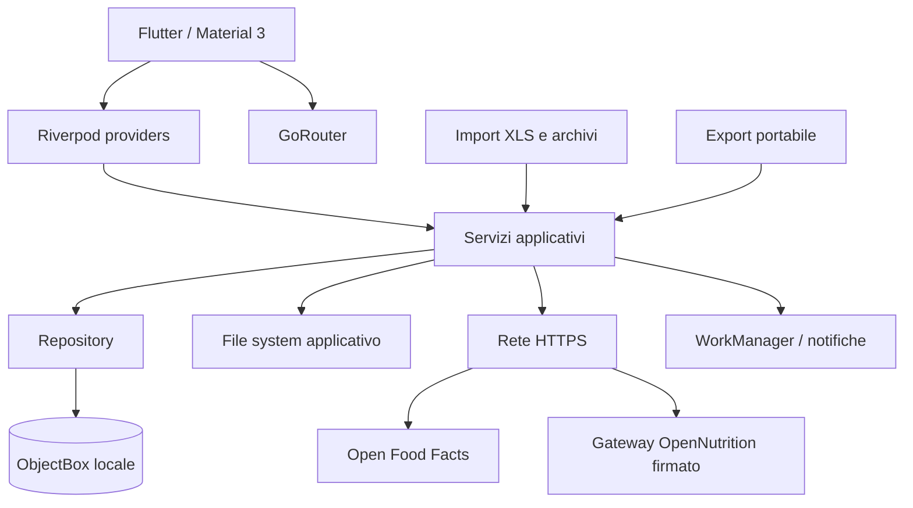

# Total Tracker

**Nutrition, measurements and workout - applicazione Flutter local-first per il tracciamento personale.**

Total Tracker riunisce in un'unica applicazione il diario alimentare, la pianificazione dei pasti, le misurazioni corporee, il calcolo adattivo degli obiettivi nutrizionali, il catalogo degli allenamenti e gli strumenti di importazione/esportazione. Il progetto nasce dall'adattamento di un sistema personale sviluppato in Obsidian e mantiene come principio centrale la proprietà locale dei dati.

> [!IMPORTANT]
> Total Tracker è in sviluppo pre-release. Non è un dispositivo medico, non effettua diagnosi e non sostituisce medico, dietista, nutrizionista o preparatore qualificato. Le calorie, la composizione corporea e i consumi attivi sono stime e devono essere interpretati insieme alla qualità e all'affidabilità dei dati disponibili.

## Stato verificato

Questa documentazione accompagna il branch `feature/0.1.0-06-ui-measurement-performance-docs`, derivato dalla base verificata:

```text
87a2b8d58dea240f0b4b69dddcb76e620b1a4729
```

Versione applicazione dichiarata in `pubspec.yaml`: `0.1.0+19`.

La base del 2026-07-08 aveva superato:

- `flutter analyze` senza rilievi;
- 12 test mirati della patch incrementale;
- 189 test della suite completa;
- build Android debug;
- push del branch dedicato, senza merge automatico su `main`.

La patch `0.1.0_06` aggiunge una nuova validazione completa e corregge cinque aree: riepilogo rapido dei pasti, selettore alimenti persistente e non modale, grafici corporei completi e filtrabili, cronologia combinata paginata a 15 elementi e query dello storico d'uso degli ingredienti.

L'audit statico di sicurezza, prestazioni e affidabilità aggiornato è disponibile in [docs/AUDIT_SICUREZZA_PRESTAZIONI_20260708.pdf](docs/AUDIT_SICUREZZA_PRESTAZIONI_20260708.pdf).

## Novità della patch 0.1.0_06

### Riepilogo rapido dei pasti

Ogni tessera pasto nella pagina completa della giornata e nella dashboard apre lo stesso riepilogo leggero. Il foglio mostra alimenti, quantità, calorie e macronutrienti, può essere chiuso con la `X` e permette di passare al dettaglio completo. La navigazione diretta che bypassava il riepilogo è stata rimossa dalle superfici interessate.

### Selettore alimenti persistente

La selezione multipla non usa più una route modale. Il pannello è una bottom sheet persistente senza barriera: quando viene trascinato verso il basso resta compresso, mantiene alimenti e grammi e lascia utilizzabile la pagina sottostante. La barra compatta mostra chiaramente che il pannello è ancora aperto e permette di espandere, continuare o chiudere con conferma.

### Grafici e cronologia delle misurazioni

I grafici di peso e grasso corporeo usano tutte le misurazioni disponibili nell'intervallo selezionato. Ogni punto è accompagnato da data completa e valore leggibile. I filtri data sono applicati prima dei grafici e della cronologia. Bilancia e metro confluiscono in un unico storico ordinato e paginato con 15 misurazioni per pagina.

### Prestazioni della scheda alimento

Lo storico d'uso di un ingrediente non scansiona più tutti i pasti eseguendo una query per ciascuno. Il repository interroga una sola volta gli item dell'ingrediente, raggruppa per pasto e carica soltanto i pasti referenziati. La complessità passa dal pattern N+1 a una query mirata più un numero di letture proporzionale ai soli pasti che contengono l'alimento.

## Obiettivi del progetto

Total Tracker è progettato per:

1. registrare alimenti, pasti, ricette, calorie e macronutrienti;
2. organizzare una giornata e una settimana alimentare senza perdere lo storico;
3. registrare peso, composizione corporea e misure antropometriche;
4. stimare obiettivi energetici e nutrizionali usando dati realmente disponibili e fallback espliciti;
5. integrare passi, attività giornaliera e calorie attive stimate degli allenamenti;
6. gestire cataloghi di esercizi, routine, schede e sessioni in modo persistente;
7. importare dati da fonti locali o esterne con anteprima, validazione e gestione dei conflitti;
8. esportare e ripristinare i dati in modo controllato;
9. funzionare principalmente offline, senza richiedere un account o un backend applicativo.

## Mappa delle funzionalità

| Area | Stato | Funzionalità principali |
|---|---|---|
| Profilo e preferenze | Implementata | Dati personali necessari ai calcoli, lingua, tema, obiettivi, distribuzione dei pasti e impostazioni correlate |
| Diario alimentare | Implementato | Giorni, pasti, ingredienti, quantità, calorie, macro, fibre, zuccheri e stato di completezza |
| Ricette | Implementate | Ingredienti, passaggi, porzioni, valori aggregati e riutilizzo nei pasti |
| Ricerca alimenti | Implementata | Catalogo locale, Open Food Facts, catalogo OpenNutrition locale e gateway opzionale firmato |
| Codici a barre | Implementati | Scansione tramite fotocamera e ricerca prodotto |
| Immagini ingredienti | Implementate | Immagini locali o HTTPS con limiti di formato, dimensioni e pixel |
| Calendario e settimana | Implementati | Navigazione giornaliera/mensile, riepiloghi settimanali e stato calorico |
| Misurazioni corporee | Implementate | Peso, composizione da bilancia, misure con metro, storico e dispositivi |
| Import XLS bilancia | Implementato | Riconoscimento colonne, anteprima, validazione, intervallo date e selezione della misurazione più recente per giorno |
| Obiettivi adattivi | Implementati | Modello versionato, affidabilità, fallback, hash degli input e ricalcolo incrementale persistente |
| Passi e calorie attive | Implementati nel modello giornaliero | Obiettivo passi configurabile, attività registrata e calorie attive degli allenamenti completati |
| Allenamenti | Fondazione persistente implementata, UI in evoluzione | Muscoli, esercizi, routine, schede, giorni, sessioni, esercizi e serie |
| Notifiche e background | Implementati per i flussi previsti | Notifiche locali e lavori differiti, in particolare per OpenNutrition |
| Import/export portabile | Implementato | Analisi preventiva, categorie selezionabili, conflitti, controlli SHA-256 e limiti anti-abuso |
| Sincronizzazione cloud | Non implementata | Possibile evoluzione futura; il modello corrente è local-first |
| Health Connect / Apple Health | Non implementati | Previsti come integrazioni future |

## Architettura

L'applicazione segue una separazione per funzionalità e, dove utile, per livelli `presentation`, `domain` e `data`.



### Principi architetturali

- **Local-first:** il database primario è sul dispositivo.
- **Persistenza unica condivisa:** i repository ricevono lo stesso `Store` ObjectBox aperto nel bootstrap.
- **Identità stabile:** le entità applicative usano UUID oltre agli ID interni ObjectBox.
- **Soft delete:** molte entità conservano lo storico tramite marcatura di eliminazione.
- **Snapshot storici:** i valori nutrizionali usati da pasti e ricette non dipendono esclusivamente dallo stato corrente dell'ingrediente.
- **Calcoli versionati:** il modello degli obiettivi e gli hash degli input espongono la revisione usata.
- **Importazione in due fasi:** analisi/anteprima prima della scrittura definitiva.
- **Aggiornamenti incrementali:** una modifica a un input invalida soltanto l'intervallo temporale interessato.

## Bootstrap e navigazione

`lib/main.dart` inizializza Flutter, il database e i servizi necessari. L'app principale è esposta da `TotalTrackerApp` e usa:

- Riverpod per dipendenze e stato;
- GoRouter per la navigazione;
- Material 3 per tema e componenti;
- localizzazioni generate per italiano e inglese;
- `TargetRecalculationCoordinatorHost` come host persistente del ricalcolo incrementale dopo che il database è pronto.

La navigazione globale collega home, Food Plan, misurazioni, impostazioni e le superfici del modulo allenamento disponibili nella release corrente.

## Profilo e impostazioni

Il profilo contiene i dati necessari per personalizzare l'esperienza e alimentare i calcoli. Le proprietà esatte evolvono con lo schema, ma comprendono i principali dati antropometrici, preferenze applicative e obiettivi.

Le impostazioni gestiscono, tra le altre cose:

- lingua italiana o inglese;
- tema chiaro, scuro o di sistema;
- obiettivo passi configurabile;
- impostazioni degli obiettivi nutrizionali;
- distribuzione uniforme o personalizzata dei target tra i pasti;
- notifiche e categorie abilitate;
- importazione/esportazione;
- spiegazioni dei calcoli e delle fonti del modello.

Le modifiche rilevanti per il modello nutrizionale vengono registrate come invalidazioni a partire dalla data locale efficace. Tema e lingua non provocano ricalcoli nutrizionali.

## Food Plan e diario alimentare

### Giorno alimentare

Ogni giornata persistente può contenere:

- obiettivi calorici e nutrizionali calcolati;
- calorie e nutrienti consumati;
- passi, attività e calorie attive;
- stato di affidabilità e metadati del calcolo;
- slot pasto e relativi elementi;
- indicatori di giornata completa, parziale o priva di dati sufficienti.

Il sistema evita di creare automaticamente giorni futuri soltanto per propagare un ricalcolo. Una modifica storica ricalcola in ordine cronologico i giorni già esistenti dalla data interessata fino all'ultimo record attivo.

### Pasti

I pasti sono associati a una giornata e conservano gli elementi consumati. Le funzioni principali comprendono:

- aggiunta di ingredienti singoli;
- selezione multipla tramite pannello a scorrimento;
- modifica delle quantità;
- riepilogo rapido del pasto dalla pagina del giorno;
- apertura del dettaglio completo;
- somme di calorie, proteine, carboidrati, grassi, fibre e zuccheri;
- supporto a pasti standard, liberi tracciati e stime manuali.

Il selettore multiplo è persistente e non modale. Quando viene trascinato verso il basso conserva alimenti e quantità, si comprime in una barra chiaramente riconoscibile e lascia utilizzabile la pagina sottostante. La chiusura definitiva richiede una conferma quando esiste una selezione.

### Ingredienti

Un ingrediente locale può includere:

- nome e identificatori;
- barcode/EAN;
- valori nutrizionali normalizzati;
- porzione e unità;
- origine dei dati;
- immagine locale o URL remoto;
- metadati di creazione, aggiornamento e archiviazione.

I repository impediscono valori nutrizionali negativi e supportano ricerca per nome e barcode. L'archiviazione mantiene i riferimenti storici.

### Ricette

Le ricette aggregano ingredienti e passaggi ordinati. Il modello permette di:

- definire quantità e posizione di ogni ingrediente;
- definire passaggi ordinati;
- calcolare valori totali e per porzione;
- conservare immagini e metadati associati;
- riutilizzare la preparazione nei flussi alimentari.

## Ricerca alimenti e fonti esterne

### Catalogo locale

La ricerca locale usa gli ingredienti già importati o creati dall'utente. La paginazione visibile è limitata e la ricerca combinata continua correttamente quando sono già presenti risultati esterni.

### Open Food Facts

L'integrazione Open Food Facts supporta:

- ricerca per testo;
- ricerca e deduplicazione per barcode;
- mapping dei nutrienti disponibili;
- acquisizione dell'URL immagine HTTPS;
- persistenza come ingrediente locale prima dell'uso stabile.

I dati di Open Food Facts sono collaborativi e possono essere incompleti o errati. L'app deve quindi conservare origine e avvisi, senza trattare la fonte come verità clinica.

### OpenNutrition locale

Il catalogo OpenNutrition può essere importato localmente da un dataset controllato. Il parser gestisce record TSV, campi JSON incorporati, virgolette, tabulazioni e righe multilinea, applicando limiti di dimensione e requisiti minimi per identificatore e nome.

### Gateway OpenNutrition firmato

È presente un client opzionale per un gateway HTTPS. Le risposte sono validate tramite firma Ed25519, schema noto, limiti di dimensione e controllo di freschezza. URL, chiave pubblica e identificatore della chiave possono essere forniti a compile time; la configurazione runtime è destinata allo sviluppo e deve essere disabilitata o fortemente limitata in una release pubblica.

## Immagini degli ingredienti

Le immagini locali sono conservate nella directory di supporto dell'app con nomi generati. Il servizio applica:

- limite di 8 MiB;
- formati PNG, JPEG e WebP riconosciuti tramite magic bytes;
- dimensione massima per lato;
- limite al numero totale di pixel;
- controllo della coerenza tra contenuto ed estensione dichiarata.

Gli URL remoti devono usare HTTPS e superare controlli sintattici su host, credenziali, frammenti e indirizzi locali evidenti.

Il servizio corrente non deve essere interpretato come sanitizzazione completa: l'audit allegato segnala il rischio residuo di metadati EXIF e payload formalmente validi ma non ricodificati.

## Calendario, dashboard e settimana

L'app fornisce viste giornaliere, mensili e settimanali. I riepiloghi mostrano:

- calorie consumate rispetto al target;
- nutrienti principali;
- stato del giorno;
- pasti in ordine;
- andamento delle misurazioni disponibili;
- indicatori dell'affidabilità del calcolo.

Le query e i provider cercano di riutilizzare un singolo calcolo live per giornata evitando duplicazioni nella dashboard e nell'hub settimanale. Il tap su qualunque pasto nelle superfici giornaliere apre prima il riepilogo rapido uniforme e soltanto da lì il dettaglio completo.

## Misurazioni corporee

### Bilancia

Le misurazioni da bilancia possono includere, quando disponibili:

- peso;
- percentuale di grasso;
- massa muscolare;
- acqua corporea;
- grasso viscerale e sottocutaneo;
- massa ossea;
- età metabolica;
- ulteriori campi supportati dallo schema corrente;
- identificatore e nome del dispositivo;
- codice di affidabilità e avvisi di qualità.

I valori non sono accettati automaticamente come clinicamente corretti. Il validatore distingue errori bloccanti, avvisi e informazioni. La qualità della singola misura è distinta dall'affidabilità della composizione usata nel modello energetico.

I grafici di peso e grasso corporeo includono tutti i valori nell'intervallo data selezionato. Le date sono presentate in formato completo e ogni punto è affiancato dal valore numerico. La cronologia combina bilancia e metro in ordine temporale e usa pagine da 15 elementi, senza il precedente taglio fisso delle sole ultime registrazioni.

### Catalogo dispositivi

Il catalogo delle bilance conserva identità, alias, dispositivo predefinito, archiviazioni e tombstone. Questo evita che un dispositivo eliminato venga ricreato automaticamente da una successiva sincronizzazione o importazione. Le fusioni devono aggiornare i riferimenti delle misure e gli alias in modo coerente.

### Import XLS legacy

L'importatore XLS è progettato per fogli di bilance consumer con intestazioni variabili. Il flusso comprende:

1. scelta del file;
2. controllo dei limiti del workbook;
3. scansione dei fogli non vuoti;
4. matching esatto o parziale delle colonne note;
5. normalizzazione di data e ora locali;
6. validazione di ogni riga;
7. anteprima selezionabile;
8. filtro rapido con data iniziale e finale inclusive;
9. opzione per mantenere una sola misurazione per giorno;
10. scelta automatica della riga con orario valido più recente;
11. selezione stabile della prima riga del workbook in caso di parità;
12. importazione batch atomica delle righe scelte;
13. riepilogo finale di importati, esclusi, conflitti e avvisi.

Una riga senza orario è considerata precedente a qualsiasi riga dello stesso giorno con orario valido. Le righe deselezionate restano visibili e possono essere riattivate manualmente.

### Misure con metro

Le misurazioni antropometriche con metro usano una testata e voci ordinate, così da supportare diversi punti corporei senza moltiplicare le entità. Le voci sono persistenti, esportabili e sottoposte alle stesse regole di storico e soft delete.

## Modello adattivo degli obiettivi

Il modello corrente è identificato come `target-model-0.1.0-theo.5`. L'obiettivo non è produrre un numero apparentemente preciso, ma una stima auditabile con sorgenti, fallback e limiti espliciti.

### Componenti

A seconda dei dati disponibili, il calcolo può combinare:

- dati del profilo;
- peso e storico del peso;
- composizione corporea ritenuta sufficientemente affidabile;
- passi giornalieri e obiettivo personale;
- attività giornaliera registrata;
- calorie attive stimate delle sessioni di allenamento completate;
- consumo alimentare osservato;
- trend robusti e guardrail contro variazioni implausibili.

Il modello usa fallback component-wise: l'assenza o l'inaffidabilità di un singolo componente non deve annullare automaticamente gli altri dati validi.

### Affidabilità

L'app espone motivazioni e fattori di affidabilità. Esempi di elementi che riducono la fiducia:

- copertura temporale insufficiente;
- valori di composizione fuori intervallo;
- forte variazione dell'acqua corporea;
- cambio o conflitto tra dispositivi;
- misurazioni incomplete;
- dati alimentari parziali;
- evidenza osservata insufficiente.

Quando la composizione non è idonea, il sistema mantiene un fallback basato sul peso e registra la ragione invece di usare silenziosamente dati dubbi.

### Ricalcolo incrementale persistente

Le modifiche agli input pubblicano un evento causale e creano un record di invalidazione ObjectBox. Il coordinatore:

- attende che il database sia pronto;
- recupera invalidazioni rimaste `processing` dopo un'interruzione;
- applica debounce e coalescenza degli intervalli;
- esegue un solo batch alla volta;
- ricalcola in ordine cronologico i giorni esistenti interessati;
- usa hash canonici degli input per evitare salvataggi inutili;
- separa gli input utente dagli snapshot calcolati per evitare cicli;
- registra stato `pending`, `processing`, `completed` o `failed`;
- limita i tentativi ripetuti e consente la ripresa al riavvio;
- pubblica un solo refresh UI finale per batch.

`targetSourceHash` resta dedicato alla sorgente/versione del modello, mentre `targetInputHash`, `targetInputHashVersion` e `targetCalculationRevision` descrivono gli input effettivi e la revisione del risultato.

## Passi, attività e calorie attive

L'obiettivo passi è configurabile dall'utente e non è trattato come soglia universale. Il calcolo può usare altezza e peso per una stima più contestuale della distanza e dell'attività; in assenza dei dati necessari applica un fallback documentato.

Per gli allenamenti, il collegamento con il giorno alimentare usa il valore persistito di calorie attive stimate della sessione completata. Il consumo basale non deve essere sommato nuovamente come calorie attive.

## Modulo allenamenti

Il modulo dispone di una fondazione persistente più ampia di quanto indicato nella vecchia documentazione. Lo schema e i repository coprono:

- catalogo muscoli con gruppi;
- esercizi e modalità;
- relazioni esercizio-muscolo con ruolo primario/secondario;
- routine;
- esercizi e serie template di routine;
- schede/piani di allenamento;
- giorni ed esercizi del piano;
- sessioni;
- esercizi e serie effettive della sessione;
- ordine, archiviazione e prevenzione dei duplicati;
- calorie attive stimate della sessione.

La maturità della UI e dei flussi operativi del modulo allenamento è inferiore a quella del Food Plan. Nuove funzioni di esecuzione, analisi e progressione devono continuare a riutilizzare le entità persistenti esistenti senza rompere l'export o il collegamento energetico giornaliero.

## Notifiche e lavori in background

L'app usa notifiche locali e WorkManager per i flussi che devono proseguire o essere ripresi. Il caso principale è la preparazione/importazione del catalogo OpenNutrition.

Lo stato del lavoro è consolidato in una preferenza JSON versionata, con migrazione dai campi precedenti. Le soglie di staleness sono volutamente più ampie dei normali ritardi di scheduling Android. Devono essere testati riavvio, terminazione del processo, perdita di rete, batteria limitata, cancellazione e spazio insufficiente.

## Importazione ed esportazione portabile

Il formato `.totaltracker` può includere categorie selezionabili di profilo, dati alimentari e allenamenti.

### Garanzie presenti

- manifest e versione del formato;
- checksum SHA-256 dei contenuti;
- allow-list delle entry ZIP;
- rifiuto di duplicati e path traversal;
- limiti su dimensione compressa ed espansa;
- limiti su profondità e numero di nodi JSON;
- analisi dei conflitti prima della scrittura;
- scelta tra mantenere, sostituire o saltare;
- scrittura export tramite file temporaneo e rename;
- applicazione import in transazione ObjectBox.

### Limite di riservatezza

Il formato corrente **non è cifrato**. SHA-256 rileva corruzioni o modifiche non coerenti con il manifest, ma non impedisce a chi ottiene il file di leggerne i dati o ricalcolare i checksum. Gli archivi devono essere trattati come dati sensibili e condivisi solo tramite canali fidati.

## Persistenza ObjectBox

Il database di produzione è aperto nella directory documenti dell'app, nella sottocartella `total_tracker_objectbox`. I test usano directory temporanee indipendenti.

File generati e versionati:

- `lib/objectbox-model.json` - identità dello schema e UID di entità/proprietà;
- `lib/objectbox.g.dart` - binding generato.

Non modificare manualmente gli UID e non eliminare il modello per risolvere conflitti: ciò può trasformare una migrazione in perdita o reinterpretazione dei dati.

Il database locale non applica attualmente cifratura applicativa. Android Auto Backup e traffico clear-text sono disabilitati, ma ciò non protegge un dispositivo sbloccato, compromesso o sottoposto a estrazione forense. Vedere l'audit allegato.

## Sicurezza già implementata

La release corrente comprende diverse difese:

- traffico clear-text disabilitato su Android;
- Auto Backup e trasferimento automatico dei dati disabilitati;
- controlli HTTPS e firma Ed25519 per il gateway OpenNutrition;
- validazione stretta delle risposte firmate;
- limiti anti-DoS per archivi, dataset e immagini;
- verifica magic bytes e dimensioni immagini;
- allow-list e path traversal protection per gli archivi;
- checksum SHA-256;
- importazioni con anteprima e conflitti;
- soft delete e identità UUID;
- CI con format, analyze, test e build debug;
- rimozione delle route mock dalla build operativa.

Queste misure riducono il rischio, ma non equivalgono a una certificazione di sicurezza. L'audit del 2026-07-08 identifica priorità residue, in particolare cifratura export, configurazione del gateway, memoria usata nei trasferimenti e query `getAll()` annidate.

## Struttura del progetto

```text
.
├── .github/workflows/          # CI
├── android/                    # progetto Android e configurazioni di sicurezza
├── assets/                     # dati, seed, icone e immagini
├── docs/                       # schema, modello teorico, policy e audit
├── lib/
│   ├── app/                    # applicazione, router, tema e navigazione
│   ├── core/                   # database, rete, notifiche, background e utility
│   ├── features/
│   │   ├── home/
│   │   ├── nutrition/         # Food Plan, misure, import, target e cataloghi
│   │   ├── profile/
│   │   ├── transfer/
│   │   └── workout/
│   ├── l10n/                   # ARB e localizzazioni generate
│   ├── main.dart
│   ├── objectbox-model.json
│   └── objectbox.g.dart
├── test/                       # unit, widget, contract e security tests
├── tool/                       # strumenti Dart di supporto
├── tools/opennutrition_gateway/# gateway e tooling OpenNutrition
└── pubspec.yaml
```

## Requisiti di sviluppo

- Flutter stable compatibile con il lockfile;
- Dart 3;
- Android SDK;
- JDK compatibile con la toolchain Flutter corrente;
- Git;
- Windows PowerShell 5.1 solo per gli script di patch distribuiti nel workflow del progetto.

Verifica ambiente:

```bash
flutter doctor -v
flutter --version
dart --version
```

## Installazione

```bash
git clone https://github.com/RaffyManzo/Total-Tracker---Nutrition-measurement-and-workout.git
cd Total-Tracker---Nutrition-measurement-and-workout
flutter pub get
```

Per lavorare sullo stato documentato:

```bash
git switch feature/0.1.0-05-hardening-incremental-targets-r1
```

## Generazione codice

ObjectBox:

```bash
dart run build_runner build
```

Localizzazioni:

```bash
flutter gen-l10n
```

Dopo la generazione:

```bash
dart format lib test
flutter analyze
flutter test
```

`--delete-conflicting-outputs` non è più accettato dalla versione corrente di `build_runner` usata dal progetto e non deve essere aggiunto ai comandi documentati.

## Avvio e build

Avvio su dispositivo o emulatore:

```bash
flutter run
```

Build Android debug:

```bash
flutter build apk --debug --no-pub
```

Il workflow operativo principale avvia l'app da Android Studio, che ricostruisce il progetto. L'APK debug è un controllo di compilazione e non è l'artefatto necessario per applicare le patch.

## Qualità e test

Comandi minimi:

```bash
dart format --set-exit-if-changed lib test
flutter analyze
flutter test
flutter build apk --debug --no-pub
```

Aree coperte dalla suite corrente:

- repository ObjectBox;
- importazione e mapping;
- sicurezza immagini e archivi;
- parser OpenNutrition;
- gateway firmato;
- ingredienti, pasti e ricette;
- misurazioni;
- matematica e contratti del target;
- affidabilità e anomalie;
- persistenza e widget principali;
- trasferimento portabile;
- catalogo esercizi e muscoli;
- stima delle calorie attive;
- selezione XLS per intervallo e ultima misura giornaliera;
- coordinatore del ricalcolo incrementale;
- contratto delle interazioni pasto e del pannello alimenti persistente;
- completezza, filtri e paginazione delle misurazioni;
- eliminazione del pattern N+1 nello storico d'uso degli ingredienti.

La suite funzionale non sostituisce benchmark, test di penetrazione, test su dispositivi reali o campagne con dataset molto grandi.

## Configurazione OpenNutrition

La configurazione di produzione dovrebbe essere fornita a compile time con `--dart-define`:

```bash
flutter run \
  --dart-define=OPENNUTRITION_GATEWAY_URL=https://gateway.example.org \
  --dart-define=OPENNUTRITION_GATEWAY_PUBLIC_KEY_BASE64=<chiave-ed25519-32-byte> \
  --dart-define=OPENNUTRITION_GATEWAY_KEY_ID=<id-chiave> \
  --dart-define=OPENNUTRITION_ALLOW_CUSTOM_GATEWAY=false
```

Per una release pubblica:

- usare solo HTTPS;
- pubblicare nell'app esclusivamente la chiave pubblica;
- conservare la chiave privata offline o come secret del gateway;
- documentare rotazione e revoca;
- disabilitare la configurazione arbitraria runtime;
- applicare rate limiting distribuito e limiti di richiesta sul server.

## Localizzazione

Le stringhe sorgente sono nei file ARB. Dopo ogni modifica:

```bash
flutter gen-l10n
```

I file sotto `lib/l10n/generated/` sono generati e versionati. Evitare modifiche manuali.

## Workflow Git e patch

Le patch del progetto:

- partono da un commit e branch esatti;
- eseguono un probe in worktree detached;
- verificano manifest e SHA-256;
- creano un branch di backup;
- applicano sul branch dedicato;
- validano prima del commit;
- effettuano push solo del branch della patch;
- non eseguono merge automatico su `main`;
- producono uno ZIP di risultato soltanto in caso di successo.

Ogni modifica allo schema ObjectBox deve includere file generati coerenti e una verifica di riproducibilità.

## Limiti noti e roadmap

Priorità prima di una release pubblica:

1. archivio `.totaltracker` cifrato e autenticato con password;
2. configurazione OpenNutrition bloccata su host e chiave di produzione;
3. decisione esplicita sulla cifratura del database locale;
4. ottimizzazione dell'export/import per evitare `getAll()` annidati e copie complete in memoria;
5. benchmark della nuova query dello storico ingredienti su database con migliaia di pasti;
6. stripping metadati e ricodifica delle immagini locali;
7. benchmark con archivi, cataloghi e storici grandi;
8. migrazione Android alla modalità Kotlin indicata dalle nuove versioni Flutter/plugin;
9. scansione automatica di advisory, SBOM e licenze;
10. test di regressione su dispositivi reali;
11. completamento e stabilizzazione della UI allenamenti;
12. eventuale integrazione Health Connect / Apple Health;
13. eventuale sincronizzazione multi-dispositivo con modello di conflitto esplicito.

## Documentazione correlata

- [Audit sicurezza e prestazioni](docs/AUDIT_SICUREZZA_PRESTAZIONI_20260708.pdf)
- [Checklist sicurezza e release](docs/SECURITY_AND_RELEASE_CHECKLIST.md)
- [Schema database V1](docs/DATABASE_SCHEMA_V1.md)
- [Schema database V2](docs/DATABASE_SCHEMA_V2.md)
- [Modello target theo.5](docs/TARGET_MODEL_0_1_0_THEO_5.md)
- [Formato trasferimento](docs/TRANSFER_FORMAT_V1.md)
- [Policy OpenNutrition](docs/OPENNUTRITION_PROGRESSIVE_SEARCH_AND_NETWORK_POLICY.md)
- [Setup del progetto](docs/PROJECT_SETUP.md)

## Privacy

Total Tracker gestisce dati che possono essere sensibili: profilo, dieta, peso, composizione corporea, misure e allenamenti. Il modello local-first riduce la condivisione automatica, ma non elimina il rischio. In particolare:

- gli export correnti non sono cifrati;
- le immagini possono contenere metadati;
- il database locale non applica una chiave di cifratura applicativa;
- le ricerche esterne rivelano al servizio remoto query, indirizzo IP e metadati di rete;
- notifiche e schermate recenti possono esporre informazioni sul dispositivo.

Non inserire dati di terzi senza autorizzazione e non pubblicare archivi di test contenenti informazioni reali.

## Licenza e contributi

La repository non deve essere considerata automaticamente redistribuibile con una licenza specifica finché non è presente un file `LICENSE` esplicito e coerente. Prima di accettare contributi esterni o pubblicare pacchetti, definire licenza del codice, licenze dei dataset e attribuzioni delle fonti.

Per contribuire:

1. aprire un branch dal commit concordato;
2. mantenere separati cambi applicativi, schema e documentazione;
3. aggiungere o aggiornare i test;
4. eseguire format, analyze e suite completa;
5. documentare migrazioni, rischi e fallback;
6. non includere dati personali, cache, APK o segreti.

## Repository

[github.com/RaffyManzo/Total-Tracker---Nutrition-measurement-and-workout](https://github.com/RaffyManzo/Total-Tracker---Nutrition-measurement-and-workout)
