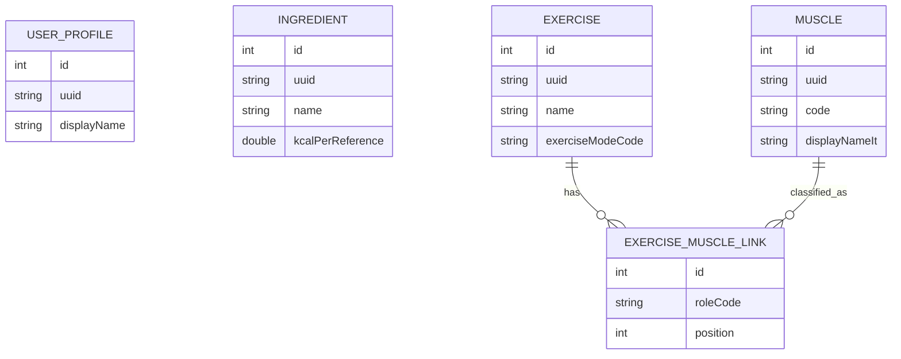

# Database Schema V1

## Motivation

Total Tracker uses ObjectBox for the local database because the first mobile
data layer needs fast local persistence, simple entity relationships, and a
local-first model that can later support import and synchronization workflows.
The previous local database direction has been removed from the current schema.

## Bottom-Up Strategy

This phase builds the data layer from stable primitives before higher-level
features. The implemented scope is intentionally limited to ObjectBox setup,
profile, ingredients, muscle catalog, exercises, exercise-muscle links,
repositories, seeding, and tests.

## Implemented Entities

- `UserProfileEntity`
- `IngredientEntity`
- `MuscleEntity`
- `ExerciseEntity`
- `ExerciseMuscleLinkEntity`

## Deferred Entities

The following entities are intentionally deferred:

- `DailyRecord`
- `Meal`
- `MealItem`
- `Recipe`
- `RecipeIngredient`
- `RecipeStep`
- `ScaleMeasurement`
- `TapeMeasurement`
- `TapeMeasurementEntry`
- `Routine`
- `RoutineExercise`
- `RoutineSetTemplate`
- `WorkoutPlan`
- `WorkoutPlanDay`
- `WorkoutPlanExercise`
- `WorkoutSession`
- `SessionExercise`
- `SessionSet`

The fridge/inventory concept will not be implemented and is not planned in the
schema.

## ObjectBox ID And UUID

Every persisted entity has an ObjectBox `@Id() int id` initialized to `0`.
This is an internal local database identifier. Main entities also have a stable
`uuid` generated by the app. UUID values are the future-safe identifiers for
exports, imports, and synchronization. ObjectBox numeric IDs must not be used as
external identities.

## Persistent Codes

Dart enum ordinals are not persisted. Stable string codes are used instead,
including values such as `manual`, `obsidian_import`, `open_food_facts`, `gym`,
`activity`, `treadmill`, `primary`, and `secondary`.

## Timestamps

Main entities include:

- `createdAtEpochMs`
- `updatedAtEpochMs`
- `deletedAtEpochMs`

Values are UTC epoch milliseconds. `deletedAtEpochMs` is nullable and reserved
for soft delete. A complete synchronization system is not implemented in this
phase.

## Muscle Catalog

The muscle catalog is defined in
`lib/features/workout/data/seed/muscle_catalog_seed.dart`.

`muscleCatalogVersion = 1` is centralized in code. The catalog contains stable
codes, Italian and English display names, group codes, body-region codes, and
sort order values. The seeder is idempotent: it inserts missing muscles,
updates descriptive catalog fields for existing codes, preserves `id` and
`uuid`, and does not delete extra persisted muscles.

## Exercise-Muscle Relations

`ExerciseMuscleLinkEntity` links exercises and muscles with:

- `ToOne<ExerciseEntity> exercise`
- `ToOne<MuscleEntity> muscle`
- `roleCode`
- `position`

Allowed role codes are `primary` and `secondary`. `position` is the explicit UI
ordering field; ObjectBox query order must not be treated as meaningful. The
repository rejects duplicate muscle-role combinations and prevents the same
muscle from being both primary and secondary for one exercise.

## Soft Delete

Entities keep `deletedAtEpochMs` for logical deletion. Public repository APIs
avoid physical deletion for main entities. Exercise-muscle links can be
physically replaced as part of `replaceMuscles`, which is a local relationship
rewrite operation.

## Future Obsidian Import

Future Obsidian import should map source records to stable UUIDs and string
codes. Imported food items should use `sourceTypeCode = obsidian_import` and
store optional source metadata without assuming ObjectBox numeric IDs are
stable outside the local database.

## Future Synchronization

Future sync should treat UUIDs as external identities, timestamps as local
change metadata, and ObjectBox IDs as local-only foreign keys. Conflict rules,
tombstone retention, account identity, and backend transport are deliberately
out of scope for schema V1.

## Mermaid

## Future Entities

- `DailyRecord`
- `Meal`
- `MealItem`
- `Recipe`
- `RecipeIngredient`
- `RecipeStep`
- `ScaleMeasurement`
- `TapeMeasurement`
- `TapeMeasurementEntry`
- `Routine`
- `RoutineExercise`
- `RoutineSetTemplate`
- `WorkoutPlan`
- `WorkoutPlanDay`
- `WorkoutPlanExercise`
- `WorkoutSession`
- `SessionExercise`
- `SessionSet`
